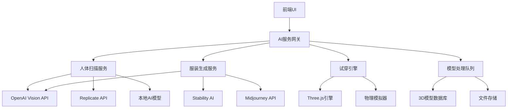

# AI集成功能设计文档

## 概述

设计并实现AI驱动的3D模型生成和智能试穿系统，集成多个AI服务提供商，为用户提供从照片到3D模型的完整工作流。

## 架构

### 系统架构图



## 组件和接口

### 1. AI服务网关 (AIServiceGateway)

**职责**: 统一管理所有AI服务调用，提供负载均衡和故障转移

**接口**:
```typescript
interface AIServiceGateway {
  generateBodyModel(images: File[], options: BodyScanOptions): Promise<BodyModel3D>
  generateClothingModel(image: File, options: ClothingGenOptions): Promise<ClothingModel3D>
  enhanceModel(model: Model3D, enhancement: EnhancementType): Promise<Model3D>
  getServiceStatus(): Promise<ServiceStatus[]>
}
```

### 2. 人体扫描服务 (BodyScanService)

**职责**: 从照片/视频生成3D人体模型

**核心算法**:
- 单张照片: 使用深度估计 + 人体姿态检测
- 多角度照片: 立体视觉重建
- 360度视频: 运动恢复结构(SfM)

**接口**:
```typescript
interface BodyScanService {
  scanFromSinglePhoto(photo: File): Promise<BodyModel3D>
  scanFromMultiplePhotos(photos: File[]): Promise<BodyModel3D>
  scanFromVideo(video: File): Promise<BodyModel3D>
  extractBodyMeasurements(model: BodyModel3D): BodyMeasurements
}
```

### 3. 服装生成服务 (ClothingGenerationService)

**职责**: 从照片生成3D服装模型

**处理流程**:
1. 图像分割识别服装区域
2. 材质和纹理提取
3. 3D网格生成
4. 物理属性计算

**接口**:
```typescript
interface ClothingGenerationService {
  generateFromPhoto(photo: File, category: ClothingCategory): Promise<ClothingModel3D>
  extractMaterial(photo: File): Promise<MaterialProperties>
  generateTexture(photo: File): Promise<TextureMap>
  optimizeForFitting(model: ClothingModel3D): Promise<ClothingModel3D>
}
```

### 4. 智能试穿引擎 (SmartFittingEngine)

**职责**: 实现服装与人体的智能贴合

**核心技术**:
- 骨骼绑定和蒙皮
- 布料物理模拟
- 碰撞检测和响应
- 实时变形计算

**接口**:
```typescript
interface SmartFittingEngine {
  fitClothingToBody(clothing: ClothingModel3D, body: BodyModel3D): Promise<FittingResult>
  simulatePhysics(fittedModel: FittingResult): Promise<PhysicsSimulation>
  adjustForComfort(fitting: FittingResult, comfort: ComfortLevel): Promise<FittingResult>
  generateFittingPreview(fitting: FittingResult): Promise<PreviewData>
}
```

### 5. 模型处理器 (ModelProcessor)

**职责**: 3D模型的优化、转换和质量控制

**功能**:
- 网格简化和优化
- 纹理压缩和增强
- LOD生成
- 格式转换

**接口**:
```typescript
interface ModelProcessor {
  optimizeModel(model: Model3D, targetQuality: QualityLevel): Promise<Model3D>
  generateLOD(model: Model3D, levels: number): Promise<Model3D[]>
  enhanceTexture(texture: TextureMap): Promise<TextureMap>
  validateModel(model: Model3D): Promise<ValidationResult>
}
```

## 数据模型

### 3D模型基础结构

```typescript
interface Model3D {
  id: string
  type: 'body' | 'clothing'
  vertices: Float32Array
  faces: Uint32Array
  normals: Float32Array
  uvCoordinates: Float32Array
  textures: TextureMap[]
  materials: MaterialProperties[]
  metadata: ModelMetadata
}

interface BodyModel3D extends Model3D {
  measurements: BodyMeasurements
  skeleton: SkeletonData
  poseData: PoseKeypoints
}

interface ClothingModel3D extends Model3D {
  category: ClothingCategory
  size: ClothingSize
  physicsProperties: PhysicsProperties
  fittingPoints: FittingPoint[]
}
```

### AI服务配置

```typescript
interface AIServiceConfig {
  provider: 'openai' | 'replicate' | 'stability' | 'local'
  apiKey: string
  endpoint: string
  model: string
  priority: number
  rateLimit: RateLimit
  fallbackProvider?: string
}
```

## 正确性属性

*属性是应该在系统所有有效执行中保持为真的特征或行为——本质上是关于系统应该做什么的正式声明。属性作为人类可读规范和机器可验证正确性保证之间的桥梁。*

### 属性 1: 模型生成一致性
*对于任何*有效的输入图像，多次调用相同的AI服务应该生成结构相似的3D模型（允许合理的变异范围内）
**验证: 需求 1.1, 2.1**

### 属性 2: 试穿物理正确性
*对于任何*服装模型和人体模型的组合，试穿结果不应该出现明显的几何穿透或不合理的变形
**验证: 需求 3.3, 3.4**

### 属性 3: 服务故障转移
*对于任何*AI服务请求，当主要服务不可用时，系统应该自动切换到可用的备用服务
**验证: 需求 4.2**

### 属性 4: 模型质量保证
*对于任何*生成的3D模型，其顶点数、面数和纹理分辨率应该在预定义的质量范围内
**验证: 需求 5.1, 5.2**

### 属性 5: 处理进度准确性
*对于任何*正在进行的AI处理任务，报告的进度百分比应该单调递增且最终达到100%
**验证: 需求 6.1**

### 属性 6: 批量处理完整性
*对于任何*批量处理请求，所有输入项目都应该被处理，成功或失败状态都应该被正确记录
**验证: 需求 7.1, 7.2**

## 错误处理

### AI服务错误
- **网络超时**: 自动重试3次，然后切换到备用服务
- **API限额**: 实现指数退避重试策略
- **模型质量低**: 提示用户重新拍摄或调整参数

### 3D模型错误
- **网格缺陷**: 自动修复或标记为需要手动处理
- **纹理问题**: 使用默认纹理或AI增强
- **尺寸异常**: 自动缩放到合理范围

### 用户输入错误
- **图像质量差**: 提供拍摄指导和质量检测
- **不支持格式**: 自动转换或提示用户
- **文件过大**: 智能压缩保持质量

## 测试策略

### 单元测试
- AI服务接口调用
- 3D模型数据结构验证
- 图像处理算法
- 错误处理逻辑

### 集成测试
- 端到端AI工作流
- 多服务协调
- 数据库操作
- 文件存储

### 性能测试
- 大文件处理能力
- 并发请求处理
- 内存使用优化
- 响应时间基准

### 用户体验测试
- 不同设备兼容性
- 网络条件适应性
- 界面响应性
- 错误信息清晰度