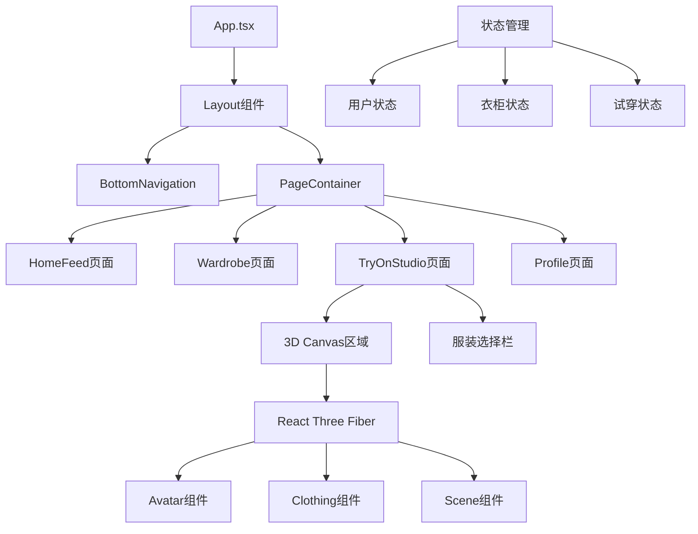

# 设计文档

## 概述

3D数字衣柜Web应用是一个基于React + Vite + Tailwind CSS的移动端优先应用，集成React Three Fiber进行3D渲染。应用采用组件化架构，支持虚拟试穿、社区分享和衣柜管理功能。

核心设计理念：
- 移动端优先的响应式设计
- 静态3D Avatar（A-pose/T-pose）避免复杂动画
- 服装挂载逻辑而非实时布料解算
- 清晰的组件分离便于React Three Fiber集成

## 架构

### 整体架构



### 技术栈

- **前端框架**: React 18 + TypeScript
- **构建工具**: Vite
- **样式框架**: Tailwind CSS
- **3D渲染**: React Three Fiber + Three.js
- **状态管理**: React Context + useReducer
- **路由**: React Router (Hash模式适配移动端)
- **图标**: Lucide React
- **手势处理**: @use-gesture/react

## 组件和接口

### 核心组件结构

```typescript
// 主应用组件
interface AppProps {}

// 布局组件
interface LayoutProps {
  children: React.ReactNode;
}

// 底部导航
interface BottomNavigationProps {
  activeTab: TabType;
  onTabChange: (tab: TabType) => void;
}

type TabType = 'home' | 'wardrobe' | 'studio' | 'profile';

// 页面组件接口
interface PageProps {
  isActive: boolean;
}
```

### 3D相关组件

```typescript
// 3D Canvas容器
interface Canvas3DProps {
  avatar: AvatarModel;
  clothing: ClothingItem[];
  onClothingChange: (item: ClothingItem) => void;
}

// Avatar组件
interface AvatarComponentProps {
  model: AvatarModel;
  pose: 'A-pose' | 'T-pose';
  clothing: WornClothing;
}

// 服装物品组件
interface ClothingComponentProps {
  item: ClothingItem;
  mountPoint: MountPoint;
  visible: boolean;
}

// 服装选择栏
interface ClothingCarouselProps {
  items: ClothingItem[];
  selectedCategory: ClothingCategory;
  onItemSelect: (item: ClothingItem) => void;
}
```

### 数据接口

```typescript
// 用户模型
interface User {
  id: string;
  username: string;
  avatar: AvatarModel;
  stats: {
    looksCreated: number;
    followers: number;
    following: number;
  };
}

// 虚拟形象模型
interface AvatarModel {
  id: string;
  userId: string;
  bodyMeasurements: BodyMeasurements;
  pose: 'A-pose' | 'T-pose';
  meshData: string; // 3D模型数据路径
}

// 身体测量数据
interface BodyMeasurements {
  height: number;
  chest: number;
  waist: number;
  hips: number;
  shoulderWidth: number;
}

// 服装物品
interface ClothingItem {
  id: string;
  name: string;
  category: ClothingCategory;
  type: ClothingType;
  meshData: string; // 3D模型数据路径
  texture: string; // 纹理贴图路径
  mountPoints: MountPoint[];
  tags: string[];
  createdAt: Date;
}

type ClothingCategory = 'tops' | 'bottoms' | 'shoes' | 'accessories';
type ClothingType = 'shirt' | 'pants' | 'dress' | 'jacket' | 'sneakers' | 'hat';

// 挂载点
interface MountPoint {
  name: string;
  position: [number, number, number];
  rotation: [number, number, number];
  scale: [number, number, number];
}

// 穿着的服装
interface WornClothing {
  top?: ClothingItem;
  bottom?: ClothingItem;
  shoes?: ClothingItem;
  accessories: ClothingItem[];
}

// 保存的造型
interface SavedLook {
  id: string;
  name: string;
  userId: string;
  clothing: WornClothing;
  screenshot: string; // 3D渲染截图
  tags: string[];
  isPublic: boolean;
  createdAt: Date;
}

// 社区动态
interface FeedPost {
  id: string;
  userId: string;
  username: string;
  userAvatar: string;
  look: SavedLook;
  likes: number;
  isLiked: boolean;
  createdAt: Date;
}
```

## 数据模型

### 状态管理结构

```typescript
// 全局应用状态
interface AppState {
  user: User | null;
  wardrobe: ClothingItem[];
  currentLook: WornClothing;
  savedLooks: SavedLook[];
  feed: FeedPost[];
  ui: UIState;
}

// UI状态
interface UIState {
  activeTab: TabType;
  loading: boolean;
  selectedCategory: ClothingCategory;
  isStudioMode: boolean;
}

// 状态操作
type AppAction = 
  | { type: 'SET_USER'; payload: User }
  | { type: 'ADD_CLOTHING_ITEM'; payload: ClothingItem }
  | { type: 'WEAR_CLOTHING'; payload: { item: ClothingItem; slot: keyof WornClothing } }
  | { type: 'SAVE_LOOK'; payload: SavedLook }
  | { type: 'SET_ACTIVE_TAB'; payload: TabType }
  | { type: 'SET_CATEGORY'; payload: ClothingCategory };
```

### 3D场景配置

```typescript
// 场景配置
interface SceneConfig {
  camera: {
    position: [number, number, number];
    fov: number;
    near: number;
    far: number;
  };
  lighting: {
    ambient: { intensity: number; color: string };
    directional: { 
      position: [number, number, number]; 
      intensity: number; 
      color: string;
    };
    point: {
      position: [number, number, number];
      intensity: number;
      color: string;
    };
  };
  platform: {
    radius: number;
    height: number;
    material: string;
  };
}

// 默认场景配置
const DEFAULT_SCENE_CONFIG: SceneConfig = {
  camera: {
    position: [0, 1.6, 3],
    fov: 50,
    near: 0.1,
    far: 1000
  },
  lighting: {
    ambient: { intensity: 0.4, color: '#ffffff' },
    directional: { 
      position: [5, 5, 5], 
      intensity: 0.8, 
      color: '#ffffff' 
    },
    point: {
      position: [-5, 3, -5],
      intensity: 0.3,
      color: '#ffffff'
    }
  },
  platform: {
    radius: 1.5,
    height: 0.1,
    material: 'metallic'
  }
};
```

现在让我使用prework工具来分析验收标准的可测试性：

<function_calls>
<invoke name="prework">
<parameter name="featureName">digital-wardrobe

## 正确性属性

*属性是一个特征或行为，应该在系统的所有有效执行中保持为真——本质上是关于系统应该做什么的正式声明。属性作为人类可读规范和机器可验证正确性保证之间的桥梁。*

基于需求分析，以下是系统必须满足的正确性属性：

### 属性1: 响应式布局适配
*对于任何*屏幕宽度在320px到768px范围内的设备，所有UI组件都应该正确显示且不出现水平滚动条
**验证需求: 需求1.3, 需求10.1**

### 属性2: 离线功能可用性
*对于任何*离线状态下的用户，基本的衣柜浏览功能应该仍然可用且不会出现错误
**验证需求: 需求1.5**

### 属性3: 导航状态一致性
*对于任何*导航项的点击操作，当前激活状态应该立即更新并与实际显示的页面保持一致
**验证需求: 需求2.3, 需求2.4**

### 属性4: 导航栏持久可见性
*对于任何*页面状态和用户操作，底部导航栏应该始终保持固定位置且可见
**验证需求: 需求2.5**

### 属性5: 动态内容渐进加载
*对于任何*向下滚动操作，当接近页面底部时应该自动加载更多内容
**验证需求: 需求3.3**

### 属性6: 点击交互响应性
*对于任何*可点击的动态项目或服装物品，点击操作应该立即触发相应的详情显示或状态变化
**验证需求: 需求3.4, 需求4.5**

### 属性7: 用户交互状态保持
*对于任何*点赞或保存操作，状态变化应该立即反映在UI中并持久保存
**验证需求: 需求3.5**

### 属性8: 分类筛选准确性
*对于任何*分类选择操作，显示的物品应该仅包含该分类的物品且不包含其他分类
**验证需求: 需求4.3**

### 属性9: 3D服装挂载即时性
*对于任何*服装物品的选择操作，该物品应该立即应用到3D虚拟形象上且不影响其他已穿着的物品
**验证需求: 需求5.3**

### 属性10: 虚拟形象姿势静态性
*对于任何*时间点，3D虚拟形象应该保持静态姿势且不播放复杂动画
**验证需求: 需求5.4**

### 属性11: 多物品组合兼容性
*对于任何*服装物品组合，用户应该能够同时穿着不同类别的多个物品而不产生冲突
**验证需求: 需求5.5**

### 属性12: 造型保存完整性
*对于任何*保存造型操作，保存的数据应该包含当前所有穿着的服装物品和时间戳
**验证需求: 需求6.2, 需求6.3**

### 属性13: 用户输入处理
*对于任何*自定义名称和标签输入，系统应该正确保存并在后续显示中保持一致
**验证需求: 需求6.4**

### 属性14: 分享功能可用性
*对于任何*保存的造型，分享到社区功能应该正常工作且在信息流中可见
**验证需求: 需求6.5**

### 属性15: 身体扫描流程引导
*对于任何*身体扫描启动操作，系统应该提供清晰的步骤引导且能够完成整个流程
**验证需求: 需求7.3**

### 属性16: 3D形象生成一致性
*对于任何*有效的扫描数据，生成的3D虚拟形象应该反映输入的身体测量参数
**验证需求: 需求7.4**

### 属性17: 用户管理功能完整性
*对于任何*用户管理操作，查看和编辑功能应该正常工作且数据保持同步
**验证需求: 需求7.5**

### 属性18: AI图片处理准确性
*对于任何*上传的服装图片，AI处理应该正确去除背景且保持服装主体完整
**验证需求: 需求8.1**

### 属性19: 3D模型转换有效性
*对于任何*处理后的服装图片，转换生成的3D模型应该可用且能够正确挂载到虚拟形象上
**验证需求: 需求8.2**

### 属性20: 输入验证准确性
*对于任何*上传的图片，系统应该能够准确识别是否包含服装物品并拒绝无效输入
**验证需求: 需求8.3**

### 属性21: 自动分类准确性
*对于任何*成功识别的服装物品，自动分类结果应该与物品的实际类型匹配
**验证需求: 需求8.4**

### 属性22: 衣柜数据同步
*对于任何*成功处理的服装物品，该物品应该立即出现在用户的数字衣柜中
**验证需求: 需求8.5**

### 属性23: 3D模型加载效率
*对于任何*3D模型加载操作，应该使用渐进式加载策略且不阻塞用户界面
**验证需求: 需求9.3**

### 属性24: 服装挂载点功能性
*对于任何*服装物品，挂载操作应该使用预定义的挂载点且实现即时换装效果
**验证需求: 需求9.4**

### 属性25: 缓存机制有效性
*对于任何*常用的3D模型，第二次及后续加载应该使用本地缓存且加载时间明显减少
**验证需求: 需求9.5**

### 属性26: 触摸目标可访问性
*对于任何*交互元素，触摸目标尺寸应该不小于44px以确保良好的移动端体验
**验证需求: 需求10.2**

### 属性27: 键盘导航完整性
*对于任何*主要功能，应该支持键盘导航且焦点顺序合理
**验证需求: 需求10.3**

### 属性28: 可访问性标准符合性
*对于任何*UI元素，应该包含适当的ARIA标签和语义化HTML以支持屏幕阅读器
**验证需求: 需求10.4**

### 属性29: 颜色对比度合规性
*对于任何*文本内容，与背景的对比度应该符合WCAG指南要求
**验证需求: 需求10.5**

## 错误处理

### 网络错误处理
- **离线状态**: 显示离线指示器，启用缓存数据浏览
- **网络超时**: 提供重试机制，显示友好的错误提示
- **API错误**: 根据错误类型显示相应的用户友好消息

### 3D渲染错误处理
- **WebGL不支持**: 降级到2D预览模式，显示静态图片
- **模型加载失败**: 显示占位符，提供重新加载选项
- **内存不足**: 自动降低模型质量，释放未使用的资源

### 用户输入错误处理
- **无效图片格式**: 显示支持格式列表，引导用户重新上传
- **图片过大**: 自动压缩或提示用户选择较小文件
- **AI处理失败**: 提供手动编辑选项或建议重新拍摄

### 数据同步错误处理
- **保存失败**: 本地暂存数据，网络恢复后自动同步
- **版本冲突**: 提供合并选项或让用户选择保留版本
- **存储空间不足**: 清理缓存，提示用户删除不需要的数据

## 测试策略

### 双重测试方法
本系统采用单元测试和基于属性的测试相结合的综合测试策略：

**单元测试**：
- 验证具体示例、边界情况和错误条件
- 测试组件的特定行为和集成点
- 确保关键功能的正确实现

**基于属性的测试**：
- 验证跨所有输入的通用属性
- 通过随机化实现全面的输入覆盖
- 每个属性测试最少运行100次迭代

### 测试框架配置
- **单元测试框架**: Vitest + React Testing Library
- **基于属性的测试**: fast-check
- **3D测试**: Three.js测试工具 + Jest-Canvas-Mock
- **端到端测试**: Playwright (移动端视口)

### 测试标签格式
每个基于属性的测试必须使用以下标签格式引用设计文档属性：
**功能: digital-wardrobe, 属性 {编号}: {属性文本}**

### 测试覆盖重点
1. **响应式设计**: 测试各种屏幕尺寸下的布局适配
2. **3D交互**: 验证服装挂载和虚拟形象操作
3. **用户流程**: 测试完整的试穿和保存流程
4. **性能**: 监控3D渲染性能和内存使用
5. **可访问性**: 验证键盘导航和屏幕阅读器支持
6. **错误恢复**: 测试各种错误场景的处理

### 移动端测试特殊考虑
- 触摸事件模拟和手势识别
- 不同设备像素比的适配测试
- 移动端浏览器兼容性验证
- 网络条件变化的适应性测试